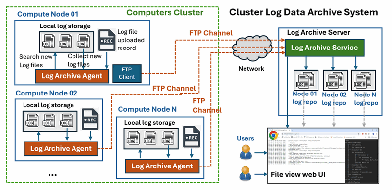
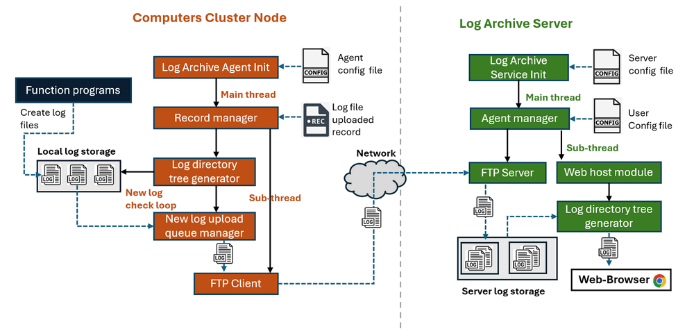
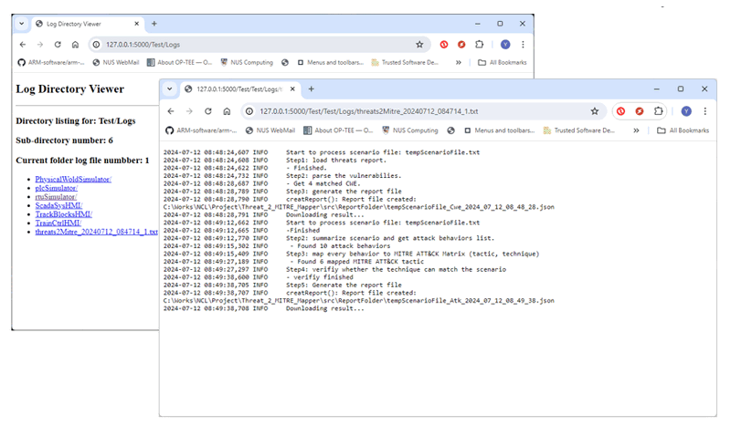

# Python_FTP_Server_and_Client

### Distributed Log File Automated Archive System



` Figure-00: Distributed Log File Automated Archive System Overview Diagram, version v1.3 (2024)`

**Program Design Purpose**: This project aims to create an FTP server&client lib program for file transfer and a files management system for log data synchronization. We will develop an automated log file archive system that regularly collects newly generated log files from multiple nodes in a computer cluster and saves them on a central log file historian server. Additionally, a web interface will be provided on the log file historian server to allow users to access and review the archived logs.

```
# Created:     2024/07/23
# Version:     v_0.1.2
# Copyright:   Copyright (c) 2024 LiuYuancheng
# License:     MIT License
```

**Table of Contents**

[TOC]

- [Python_FTP_Server_and_Client](#python-ftp-server-and-client)
    + [Distributed Log File Automated Archive System](#distributed-log-file-automated-archive-system)
    + [Introduction](#introduction)
    + [System Design](#system-design)
      - [Design of FTP Comm Library](#design-of-ftp-comm-library)
      - [Design of Log Archive Agent](#design-of-log-archive-agent)
      - [Design of Log Archive Server](#design-of-log-archive-server)
    + [System Setup](#system-setup)
        * [Development Environment](#development-environment)
        * [Additional Lib/Software Need](#additional-lib-software-need)
        * [Hardware Needed : None](#hardware-needed---none)
        * [Program Files List](#program-files-list)
    + [System Usage](#system-usage)
        * [Usage of FTP Comm Lib](#usage-of-ftp-comm-lib)
        * [Usage of Log Archive Server](#usage-of-log-archive-server)
        * [Usage of Log Archive Agent](#usage-of-log-archive-agent)
        * [View Logs Contents From Web UI](#view-logs-contents-from-web-ui)
    + [Reference](#reference)
    + [Problem and Solution](#problem-and-solution)

------

### Introduction

Often, there is a need to continuously collect program log files from numerous servers for big data analysis, system operation monitoring, or threat detection. This project will create an automated log file archiver, which can synchronize specific log storage on nodes with a central log storage server. Additionally, it provides a web interface for users to check and download log files from the web archive server. The project includes three components:

- **FTP Communication Library** : A library module providing FTP client and server functionality for log file transfer.
- **Log Archive Agent** : An agent program running on the nodes in the compute cluster to regularly check the log data status and upload newly generated log files to the log archive server with the FTP client.
- **Log Archive Server:** A service program running on the log database server to maintain several file structure trees identical to those on the client nodes, save the log files, and provide a web interface for users to search and view the logs.

The system work flow diagram is shown below:



` Figure-01: Distributed Log File Automated Archive System Workflow Diagram, version v1.1 (2024)`

To check the system usage demo, please refer to this video: https://youtu.be/5sTpMhQzxgU?si=slUAC8F-jJRHXE_M


------

### System Design

In this section, we will introduce the main features, detailed design of each module and the function of sub-modules based on the workflow diagram shown in the introduction section. 

#### Design of FTP Comm Library

The FTP Communication Library includes both server and client modules, each capable of running in parallel with the main thread to allow for seamless integration into user programs.

The FTP-server module includes the following features:

- **FTP Client Authorization** : Verifies and validates clients connecting to the server, controlling their permissions to upload, download files, create and remove directories or files.
- **User Management** : Provides an API for administrators to manage user permissions, and add or remove users.
- **Data Transfer Limitation:** Limits the file upload and download speeds for clients.

>  We use `pyftpdlib` to implement the FTP server module, reference link: https://pypi.org/project/pyftpdlib/

The FTP-client module includes the following features:

- **Connection Handling** : Login the server and manages FTP server reconnections.
- **File System Check and Switch** : Checks whether the folder exists on the server side and switches to the relevant directory.
- **File Upload and Download** :  Uploads files to and downloads files from the server.

> We use the python built-in lib `ftplib` to implement the client module, ref-link: https://docs.python.org/3/library/ftplib.html


#### Design of Log Archive Agent

The Log Archive Agent continuously monitors the node's log storage folder. When a new log file is created, it uploads the log file to the corresponding folder on the server. The main features include:

- **Uploaded File Record** :  The agent maintains a record of uploaded log files, so when the agent restarts, it knows which logs have been uploaded and which need to be uploaded.

- **New Log File Search** : The agent searches for all log files in the host log storage that match the user-defined log pattern, then compares them with the record to identify newly generated log files.

- **Log File Upload Queue** : A queue that stores the paths of new log files, transfers the logs to the server, and updates the uploaded file database.

- **FTP Client** : An FTP client that replicates the file structure on the server side and transfers the files. For example, if an agent with ID `agent01` has a log file located at `C:\usr\test\logArchiver\AgentLogFolder\Logs\PhysicalWorldSimulator\20240723\PWS_UI_20240723_111325_1.txt`, the file will be transferred to the server folder `/agent01/Logs/PhysicalWorldSimulator/20240723/` with the same log file name.

The Log Archive Agent will keep a JSON file recording the files that have been transferred to the server. It follows these steps to archive new log files:

1. When the agent starts, it checks the record file and loads the file list.
2. It checks the log file directory (specified by the user in the config file) and finds all log files that match the user-defined log file name pattern.
3. It compares the file list with the record file to identify files that need to be transferred to the server.
4. It starts the FTP client to log in to the log archive server's agent home folder and build a directory tree identical to the agent's local log directory tree.
5. It transfers the log files to the corresponding directory on the server.
6. After transferring a new log file, it updates the record file.
7. After transferring all log files, it waits for a user-defined interval (set in the config file) and then repeats the process starting from step 2.


#### Design of Log Archive Server

All agents will connect to the server to upload log files. The server manages agent access and provides a web interface for users to search and download log files. The main features include:

- **Client Authorization** : A client user record file to authorize client connections and limit file access.
- **FTP Service** : An FTP server running in the background to handle log file uploads.
- **Log Search and Download Web Host:** A web host program providing a user interface for checking, viewing, and downloading the log files archived on the server.

In the server side user permission config please follow below permission char setting table:

| Character | Permission type  | Description                      | FTP Command                                             |
| --------- | ---------------- | -------------------------------- | ------------------------------------------------------- |
| `"e"`     | Read permission  | Allow client to change directory | `CWD`, `CDUP` commands                                  |
| `"l"`     | Read permission  | Allow client to list files       | `LIST`, `NLST`, `STAT`, `MLSD`, `MLST`, `SIZE` commands |
| `"r"`     | Read permissions | Retrieve file from the server    | `RETR` command                                          |
| `"a"`     | Write permission | Append data to an existing file  | `APPE` command                                          |
| `"d"`     | Write permission | Delete file or directory         | `DELE`, `RMD` commands                                  |
| `"f"`     | Write permission | Rename file or directory         | `RNFR`, `RNTO` commands                                 |
| `"m"`     | Write permission | Create directory                 | `MKD` command                                           |
| `"M"`     | Write permission | Change file mode / permission    | `SITE CHMOD` command                                    |
| `"T"`     | Write permission | Change file modification time    | `SITE MFMT` command                                     |


------

### System Setup

##### Development Environment

- python 3.7.2rc2+ 64bit [ Windows11 ]

##### Additional Lib/Software Need

- pyftpdlib : https://pypi.org/project/pyftpdlib/, install: `pip install pyftpdlib`
- Flask: https://flask.palletsprojects.com/en/3.0.x/, install: `pip install Flask`

##### Hardware Needed : None

##### Program Files List 

| Folder | Program File         | Execution Env | Description                                                  |
| ------ | -------------------- | ------------- | ------------------------------------------------------------ |
| src    | ftpComm.py           | python 3.7 +  | The main FTP communication module includes the FTP server and client. |
| src    | ftpTestcaseClient.py | python 3.7 +  | Test case module for <ftpComm.py>, this module will start a ftp  test client use the test data set in ftpClient_data folder. |
| src    | ftpTestcaseServer.py | python 3.7 +  | Test case module for <ftpComm.py>, this module will start a ftp test server use the test data set in ftpServer_data folder. |
| src    | ftpClient_data/*     |               | FTP client test case data set.                               |
| src    | ftpServer_data/*     |               | FTP client test case data set.                               |


| Folder      | Program File              | Execution Env | Description                                  |
| ----------- | ------------------------- | ------------- | -------------------------------------------- |
| logArchiver | AgentLogFolder/*.txt      |               | Log archive agent test case data set.        |
| logArchiver | ServerLogSorage/*.txt     |               | Log archive server test case data set.       |
| logArchiver | templates/*.html          | HTML          | Log archive server web interface html pages. |
| logArchiver | AgentConfig_template.txt  | txt           | Agent config file template.                  |
| logArchiver | ConfigLoader.py           | python 3.7 +  | Config file loading module.                  |
| logArchiver | logArchiveAgent.py        | python 3.7 +  | Log archive agent main program.              |
| logArchiver | logArchiveServer.py       | python 3.7 +  | Log archive server main program.             |
| logArchiver | ServerConfig_template.txt |               | Server config file template.                 |
| logArchiver | uploadRcd.json            | JSON          | Uploaded file record file.                   |
| logArchiver | userRecord.json           | JSON          | User record file.                            |


------

### System Usage

##### Usage of FTP Comm Lib

To use the FTO communication lib in your program, please follow the test case program `ftpTestcaseClient.py` and `ftpTestcaseServer.py`

To integrate the Log archive service in your program and init:

```
dir = os.path.join(dirpath, 'ftpServer_data')
server = ftpComm.ftpServer(dir, port=8081, threadFlg=True)
server.addUser('client1', '123456')
server.startServer()
```

To integrate the log archive client to in your program and init:

```
client = ftpComm.ftpClient('127.0.0.1', 8081, 'client1', '123456')
client.connectToServer()
```


##### Usage of Log Archive Server

Change the `ServerConfig_template.txt` to `ServerConfig.txt` then follow the comments in it to set the parameters as shown the example below:

```
# This is the config file template for the module <logArchiveServer.py>
# Setup the parameter with below format (every line follows <key>:<val> format, the
# key can not be changed):

#-----------------------------------------------------------------------------
# Init the FTP server parameters
FTP_SER_PORT:8081
# default max speed for client download: 300 Kb/sec (30 * 1024)
MAX_UPLOAD_SPEED:307200
# default max speed for client upload:  300 Kb/sec (30 * 1024)
MAX_DOWNLOAD_SPEED:307200

#-----------------------------------------------------------------------------
# User record json file, need to put in same folder with the logArchiveServer.py
USER_RCD:userRecord.json

#-----------------------------------------------------------------------------
# FTP storage root folder 
LOG_DIR:ServerLogSorage
LOG_PF:.txt

#-----------------------------------------------------------------------------
# Init the Flask app parameters
FLASK_SER_PORT:5000
FLASK_DEBUG_MD:False
FLASK_MULTI_TH:True
```

Then add a valid user in the `userRcd.json` file and set the permission (refer to the design of Log Archive server side permission config), as shown the example below:

```json
{
    "admin": {
        "passwd": "******",
        "perm": "elradfmwM"
    },
    "agent": {
        "passwd": "******",
        "perm": "elr"
    }
}
```

Run the server program:

```
python3 logArchiveServer.py
```


##### Usage of Log Archive Agent

Change the `AgentConfig_template.txt` to `AgentConfig.txt` then follow the comments in it to set the parameters as shown the example below:

```
# This is the config file template for the module <logArchiveAgent.py>
# Setup the parameter with below format (every line follows <key>:<val> format, the
# key can not be changed):

#-----------------------------------------------------------------------------
# Unique Agent ID, all the log file will be saved in the server's home/<AGENT_ID>/ folder
AGENT_ID:Test

#-----------------------------------------------------------------------------
# FTP server info and login credentials, don't uplaod the credentials to the Github
FTP_SER_IP:127.0.0.1
FTP_SER_PORT:8081
USER_NAME:agent
USER_PWD:P@ssw0rd

#-----------------------------------------------------------------------------
# Uploaded files record json file, need to be at same folder of <logArchiveAgent.py>
# if not exist, the agent will create a empty one.
RCD_JSON:uploadRcd.json

#-----------------------------------------------------------------------------
# local folder save the log files. 
LOG_DIR:AgentLogFolder
# the file extension of the log files such as : .txt, .log, .csv, etc.
LOG_PF:.txt

#-----------------------------------------------------------------------------
# Time interval between 2 uplaod processes, in seconds.
UPLOAD_INV:10
```

Run the log archive agent program:

```
python logAchiveAgent.py
```


##### View Logs Contents From Web UI

To view the archived log file in the server, type in the URL `http://<webhost_IPaddress>:5000` to view the web interface and download the log files:



` Figure-02: Distributed Log File Automated Archive System WebUI screen shot, version v1.3 (2024)`

------

### Reference 

- pyftpdlib : https://pypi.org/project/pyftpdlib/

------

### Problem and Solution

- Refer to `doc/ProblemAndSolution.md`


------

> last edit by LiuYuancheng (liu_yuan_cheng@hotmail.com) by 27/07/2024 if you have any problem, please send me a message. 